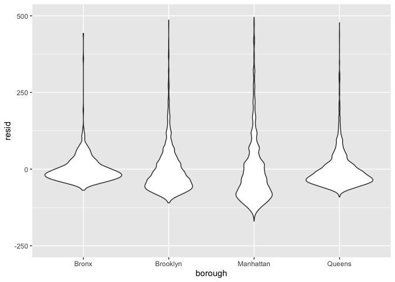

linear_models
================
Xicheng Xie
2022-11-10

## model fitting

``` r
data("nyc_airbnb")

nyc_airbnb = 
  nyc_airbnb %>% 
  mutate(stars = review_scores_location / 2) %>% 
  rename(
    borough = neighbourhood_group,
    neighborhood = neighbourhood) %>% 
  filter(borough != "Staten Island") %>% 
  select(price, stars, borough, neighborhood, room_type)
```

``` r
fit=lm(price~stars+borough,data = nyc_airbnb)
summary(fit) %>% 
  broom::tidy()
```

    ## # A tibble: 5 × 5
    ##   term             estimate std.error statistic  p.value
    ##   <chr>               <dbl>     <dbl>     <dbl>    <dbl>
    ## 1 (Intercept)         -70.4     14.0      -5.02 5.14e- 7
    ## 2 stars                32.0      2.53     12.7  1.27e-36
    ## 3 boroughBrooklyn      40.5      8.56      4.73 2.23e- 6
    ## 4 boroughManhattan     90.3      8.57     10.5  6.64e-26
    ## 5 boroughQueens        13.2      9.06      1.46 1.45e- 1

let’s change reference category

``` r
fit=
  nyc_airbnb %>% 
  mutate(
    borough=fct_infreq(borough)
  ) %>% 
  lm(price~stars+borough,data=.) %>%
  broom::tidy() %>% 
  select(term, estimate, p.value) %>% 
  mutate(term = str_replace(term, "^borough", "Borough: ")) %>% 
  knitr::kable(digits = 3)
```

## Diagnositics

``` r
fit=lm(price~stars+borough,data = nyc_airbnb)
nyc_airbnb %>% 
  modelr::add_residuals(fit) %>% 
  ggplot(aes(x=borough,y=resid))+
  geom_violin()+
  ylim(-250,500)
```

    ## Warning: Removed 10202 rows containing non-finite values (stat_ydensity).

<!-- -->

## hypothesis testing

one coefficient

``` r
fit_null = lm(price ~ stars + borough, data = nyc_airbnb)
fit_alt = lm(price ~ stars + borough + room_type, data = nyc_airbnb)
anova(fit_null, fit_alt) %>% 
  broom::tidy()
```

    ## Warning: Unknown or uninitialised column: `term`.

    ## # A tibble: 2 × 7
    ##   term                              df.re…¹    rss    df   sumsq stati…² p.value
    ##   <chr>                               <dbl>  <dbl> <dbl>   <dbl>   <dbl>   <dbl>
    ## 1 price ~ stars + borough             30525 1.01e9    NA NA          NA       NA
    ## 2 price ~ stars + borough + room_t…   30523 9.21e8     2  8.42e7   1394.       0
    ## # … with abbreviated variable names ¹​df.residual, ²​statistic

## Room type by borough

``` r
fit<-
  nyc_airbnb %>% 
  lm(price~stars+borough*room_type,data=.) %>% 
  broom::tidy() 
```

``` r
nyc_airbnb %>% 
  nest(df=-borough) %>% 
  mutate(
    models=map(.x=df,~lm(price~stars+room_type,data =.x)),
    results=map(models,broom::tidy)
         ) %>% 
  select(borough,results) %>% 
  unnest(results)
```

    ## # A tibble: 16 × 6
    ##    borough   term                  estimate std.error statistic   p.value
    ##    <chr>     <chr>                    <dbl>     <dbl>     <dbl>     <dbl>
    ##  1 Bronx     (Intercept)              90.1      15.2       5.94 5.73e-  9
    ##  2 Bronx     stars                     4.45      3.35      1.33 1.85e-  1
    ##  3 Bronx     room_typePrivate room   -52.9       3.57    -14.8  6.21e- 41
    ##  4 Bronx     room_typeShared room    -70.5       8.36     -8.44 4.16e- 16
    ##  5 Queens    (Intercept)              91.6      25.8       3.54 4.00e-  4
    ##  6 Queens    stars                     9.65      5.45      1.77 7.65e-  2
    ##  7 Queens    room_typePrivate room   -69.3       4.92    -14.1  1.48e- 43
    ##  8 Queens    room_typeShared room    -95.0      11.3      -8.43 5.52e- 17
    ##  9 Brooklyn  (Intercept)              69.6      14.0       4.96 7.27e-  7
    ## 10 Brooklyn  stars                    21.0       2.98      7.05 1.90e- 12
    ## 11 Brooklyn  room_typePrivate room   -92.2       2.72    -34.0  6.40e-242
    ## 12 Brooklyn  room_typeShared room   -106.        9.43    -11.2  4.15e- 29
    ## 13 Manhattan (Intercept)              95.7      22.2       4.31 1.62e-  5
    ## 14 Manhattan stars                    27.1       4.59      5.91 3.45e-  9
    ## 15 Manhattan room_typePrivate room  -124.        3.46    -35.8  9.40e-270
    ## 16 Manhattan room_typeShared room   -154.       10.1     -15.3  2.47e- 52

Quick double check
